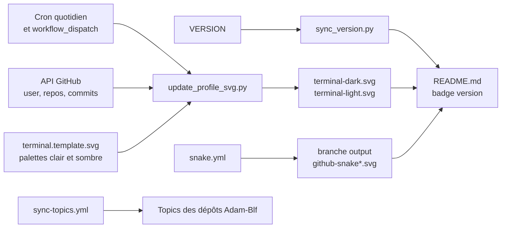

# Adam Beloucif

**Data Engineer & Fullstack Developer** - M2 Data Engineering & IA à l'EFREI - Paris

<!-- adam-badges:start -->

<!-- adam-badges:end -->

<picture>
  <source media="(prefers-color-scheme: dark)" srcset="assets/terminal-dark.svg">
  <source media="(prefers-color-scheme: light)" srcset="assets/terminal-light.svg">
  
</picture>

## À propos

Alternant **Ingénieur PMSI et Data Engineer** au DIM de pédopsychiatrie du GHT Sud Paris
depuis septembre 2025, deuxième année en cours : pipelines de données hospitalières, formats ATIH, indicateurs
d'activité et outils métier livrés aux équipes soignantes.

En parallèle, je construis des applications de bout en bout, de la modélisation des
données à l'interface : architectures médaillon, moteurs de recommandation, PWA et
applications mobiles natives.

| | |
|---|---|
| **Formation** | M2 Mastère Data Engineering & IA, EFREI Villejuif (RNCP 40875), après un Bachelor International Communication & Technology EFREI x ISIT (RNCP 35541) |
| **Échange** | Universidad de Málaga, semestre Erasmus |
| **Langues** | Français natif, anglais et espagnol C1 |
| **Associatif** | Vice-président du BDE ISIT, deux mandats, 700 étudiants et 40 nationalités |
| **Contact** | [adam.beloucif@efrei.net](mailto:adam.beloucif@efrei.net) |

## BLF Lab's

Mon studio de développement, entreprise individuelle immatriculée au RNE en août 2026.
Je conçois et livre des **sites et des applications sur mesure**, de la maquette à la mise
en ligne : vitrines, applications métier, boutiques, outils internes.

**[beloucif.com](https://beloucif.com)** porte la vitrine et la prise de commande. Le
back-office qui va avec gère les demandes entrantes, les projets, les devis et les factures,
avec authentification à deux facteurs.

| | |
|---|---|
| **Site** | [beloucif.com](https://beloucif.com) |
| **Dépôt** | [blf-labs-site](https://github.com/Adam-Blf/blf-labs-site) |
| **Stack** | Next.js 16, Tailwind 4, Supabase, Stripe, Resend, déployé sur Vercel |
| **Zone** | Île-de-France, et à distance |

## Stack

| Domaine | Outils |
|---|---|
| Langages | Python, TypeScript, C# .NET, SQL, PHP, C++ |
| Data & IA | pandas, Polars, scikit-learn, XGBoost, Spark, Kafka, ksqlDB, MLflow, architecture médaillon |
| Web | Next.js, React, Node.js, FastAPI, Tailwind CSS, Three.js |
| Mobile | React Native et Expo, Jetpack Compose, SwiftUI |
| Bases | PostgreSQL, Supabase, Oracle, MongoDB, Cassandra, BigQuery |
| Cloud & outils | Vercel, Azure, Google Cloud, Docker, Git, GitHub Actions |

## Projets

| Projet | Ce que c'est | Stack |
|---|---|---|
| [sovereign_os_dim](https://github.com/Adam-Blf/sovereign_os_dim) | Station PMSI pour un DIM hospitalier, 23 formats ATIH | Python, C# .NET 8, FastAPI, XGBoost |
| [urban-data-explorer](https://github.com/Adam-Blf/urban-data-explorer) | Indicateurs socio-urbains de Paris, 83 sources open data | PostgreSQL, Cassandra, Kafka, FastAPI, React |
| [chest-xray-triage-system](https://github.com/Adam-Blf/chest-xray-triage-system) | Triage de radiographies thoraciques, fusion image et texte | CNN, ResNet, ViT, MLflow, Streamlit |
| [open-health-data-pipeline](https://github.com/Adam-Blf/open-health-data-pipeline) | Pipeline open data santé et moteur k-anonymat / l-diversité | Python, pandas, pytest |
| [crypto-market-monitor](https://github.com/Adam-Blf/crypto-market-monitor) | Suivi de marché crypto en temps réel | Kafka, Node.js, TypeScript, WebSocket |
| [Langue-des-signes](https://github.com/Adam-Blf/Langue-des-signes) | Apprentissage de la langue des signes, 7 langues | Vision par ordinateur, deep learning |
| [bacchana](https://github.com/Adam-Blf/bacchana) | Jeu de soirée, 13 modes, décliné en web, Android et iOS | React 19, Kotlin, SwiftUI |
| [festayre](https://github.com/Adam-Blf/festayre) | PWA des ferias du Sud-Ouest | Next.js, Supabase, Stripe |
| [blf-labs-site](https://github.com/Adam-Blf/blf-labs-site) | Vitrine et back-office de BLF Lab's, devis et factures | Next.js 16, Tailwind 4, Supabase, Stripe |
| [eden-facturation](https://github.com/Adam-Blf/eden-facturation) | 404 Monkey, facturation et gestion pour associations et entreprises | Next.js 16, Supabase, Stripe |

Les réalisations livrées sous BLF Lab's sont sur [beloucif.com/references](https://beloucif.com/references).

## Statistiques

<picture>
  <source media="(prefers-color-scheme: dark)" srcset="https://raw.githubusercontent.com/Adam-Blf/Adam-Blf/output/github-snake-dark.svg">
  <source media="(prefers-color-scheme: light)" srcset="https://raw.githubusercontent.com/Adam-Blf/Adam-Blf/output/github-snake.svg">
  
</picture>

## Architecture

Ce dépôt n'est pas qu'un README : trois workflows planifiés le tiennent à jour tout seul.

<a href="https://beloucif.com">beloucif.com</a>, Data Engineer & Fullstack Developer

