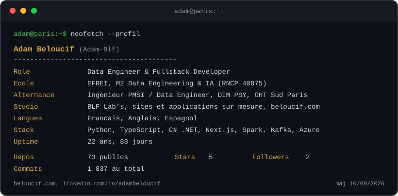

<picture>
  <source media="(prefers-color-scheme: dark)" srcset="assets/terminal-dark.svg">
  <source media="(prefers-color-scheme: light)" srcset="assets/terminal-light.svg">
  
</picture>

# Hi, I'm Adam Beloucif

<!-- adam-badges:start -->
    
<!-- adam-badges:end -->

Data Engineer & Fullstack Developer - trilingue FR / EN / ES - basé à Paris.

- **M1 Mastère Data Engineering & IA** - [EFREI](https://www.efrei.fr) Villejuif - RNCP 40875
- **Alternance** - [Fondation Vallée](https://www.psysudparis.fr) - Ingénieur PMSI / Data Engineer DIM PSY (GHT Sud Paris)
- **Stack** - Python - TypeScript - C# .NET - Next.js - Flutter - BigQuery - Azure
- **Recherche alternance M2** - sept. 2026 → sept. 2027 - IDF - grands groupes data / ML / IA

---

## Projets phares

### [Sovereign OS DIM](https://github.com/Adam-Blf/sovereign_os_dim)
Station DIM PMSI pour le GHT Sud Paris - Python 3.12 + C# .NET 8 + WebView2. Scan automatique de **23 formats ATIH**, MPI avec identitovigilance, preflight DRUIDES, analyse d'activité par UM, export e-PMSI. **178 tests Python + 30 JS**. Interface française, dark mode, 100 % local RGPD.

### [Let Me Cook V1](https://github.com/Adam-Blf/let-me-cook-v1)
PWA Next.js 16 qui extrait les recettes de vidéos YouTube et posts Instagram. Supabase + Stripe + LLM d'extraction structurée. Mobile-first, auth magic link, paywall premium.

### [Career Ops](https://github.com/Adam-Blf/career-ops)
Pipeline de recherche d'alternance piloté par agents IA - 14 modes de skills (scan Greenhouse/Ashby/Lever, scoring A-G, génération CV + LM ciblés, tracker TSV, follow-up cadence). Open-source MIT.

### [pgvplaning](https://github.com/Adam-Blf/pgvplaning)
Planning soignants Fondation Vallée - Next.js + Firebase + Supabase. Version prod déployée sur `planning.beloucif.com`.

### [A.B.E.L](https://github.com/Adam-Blf/A.B.E.L)
Assistant Personnel PWA - TypeScript - contextes persistants, mémoire long-terme, intégration agendas.

### [Festayre](https://github.com/Adam-Blf/festayre)
PWA Next.js 16 pour les ferias du Sud-Ouest - toilettes, alcool pas cher, bus, programme - Supabase + Stripe + Overpass, offline-first.

### [Eden Facturation](https://github.com/Adam-Blf/eden-facturation)
SaaS de facturation et compta micro-entreprise - Next.js 16 + react-pdf + Supabase - aperçu PDF live, paiements Stripe.

### [Crypto Market Monitor](https://github.com/Adam-Blf/crypto-market-monitor)
Monitoring crypto temps réel - Kafka + Node.js TS + WebSocket + React - M1 EFREI Real-Time Engineering.

### [Echo](https://github.com/Adam-Blf/Echo)
PWA de rencontres - React - authenticité temps réel, matching asynchrone.

---

## Data Engineering & IA

- **[Projet Data Eng M1](https://github.com/Adam-Blf/projet-dataeng-m1)** - Architecture Médaillon collaborative (bronze/silver/gold) - BigQuery + Spark.
- **[Accidentologie BAAC](https://github.com/Adam-Blf/accidentologie-baac-20)** - Analyse premium 20/20 Open Data accidents routiers France.
- **[EFREI NLP Anime Reco](https://github.com/Adam-Blf/EFREI-NLP-Anime-Recommendation)** - TF-IDF - Cosine Similarity - 20 000 animes indexés.
- **[IA Pero Final](https://github.com/Adam-Blf/ia-pero-final)** - Sentence-Transformers SBERT - similarité sémantique FR.
- **[Langue des Signes](https://github.com/Adam-Blf/Langue-des-signes)** - Computer Vision MediaPipe - 7 langues supportées.
- **[Wine Quality ML](https://github.com/Adam-Blf/ProjetML-EFREI)** - XGBoost + RF - binôme Emilien Morice.
- **[Doctis IA Générative](https://github.com/Adam-Blf/Projet-IA-Generative-Doctis-AI-mo)** - LLM médical - binôme Amina Medjdoub.
- **[Urban Data Explorer](https://github.com/Adam-Blf/urban-data-explorer)** - logement + dynamiques territoriales.
- **[Maintenance Prédictive Industrielle](https://github.com/Adam-Blf/maintenance-predictive-industrielle)** - système intelligent multi-modèles - M1 EFREI BC2.
- **[MixCraft](https://github.com/Adam-Blf/cocktail-ia-generatif)** - génération de cocktails - SBERT + FAISS + RAG.
- **[Chest X-Ray Triage](https://github.com/Adam-Blf/chest-xray-triage-system)** - CNN, ResNet, ViT + anomalies VAE - MLflow + Streamlit.
- **[Olist Medallion Platform](https://github.com/Adam-Blf/projet-bdf-m1-olist)** - Big Data Frameworks - plateforme médaillon Olist.

## Portfolio & PWA

- **[Portfolio](https://adam.beloucif.com)** - Next.js + Three.js + anime.js + Tailwind (Vercel)
- **[GlouGlou](https://github.com/Adam-Blf/GlouGlou)** - jeu de l'oie apéro - PWA React
- **[Skyjo Multiplayer](https://github.com/Adam-Blf/skyjo-multiplayer)** - jeu de cartes temps réel
- **[Genius](https://github.com/Adam-Blf/genius)** - flashcards culture générale gamifiées
- **[Mendelieve.io](https://github.com/Adam-Blf/Mendelieve.io)** - tableau périodique interactif
- **[ChessAI Self-Learning](https://github.com/Adam-Blf/ChessAI-SelfLearning-Web)** - deep learning in-browser
- **[Blackout](https://github.com/Adam-Blf/black-out)** - jeu apéro immersif
- **[Hadiway](https://github.com/Adam-Blf/hadiway)** - PWA routing accessible PMR
- **[Relation Graph](https://github.com/Adam-Blf/relation_graph)** - force graph interactif
- **[BeeBle](https://github.com/Adam-Blf/BeeBle)** - plateforme collaborative TS

## Outils & Scripts

- **[DimMoulinette](https://github.com/Adam-Blf/dimmoulinette)** - automatisation DIM Python
- **[Excel Cleaner](https://github.com/Adam-Blf/ExecelCleaner)** - normalisation xlsx
- **[Folder Analyzer](https://github.com/Adam-Blf/folder-analyzer-web)** - audit arborescence navigateur
- **[Pin Collector](https://github.com/Adam-Blf/pin-collector)** - catalogage collections Streamlit

## Jeux

[Snake](https://github.com/Adam-Blf/Snake-Game) - [Pong](https://github.com/Adam-Blf/Pong-Game) - [PMU](https://github.com/Adam-Blf/PMU-Game) - [Borderland](https://github.com/Adam-Blf/Borderland) - [Blackjack Simulator](https://github.com/Adam-Blf/Blackjack-Simulator) - [Guess the Number](https://github.com/Adam-Blf/Guess-The-Number)

---

## Leadership & Bénévolat

- **Vice-Président BDE ISIT** - 2 mandats - 700 étudiants - 40 nationalités - 9 langues de travail (fév. 2024 → sept. 2025)
- **Cours de danse bénévoles** chaque week-end
- **Préparation Militaire Marine Kieffer** - Marine Nationale - mention Assez Bien (2020-2021)

## Certifications en préparation (2026)

- Microsoft Azure **AZ-900** (Azure Fundamentals)
- Microsoft Azure **AI-900** (AI Fundamentals)

---

## Stats

---

  Par <a href="https://adam.beloucif.com">Adam Beloucif</a> - Data Engineer & Fullstack Developer - <a href="https://github.com/Adam-Blf">GitHub</a> - <a href="https://www.linkedin.com/in/adambeloucif/">LinkedIn</a>

## Star History

<a href="https://www.star-history.com/?repos=Adam-Blf%2FAdam-Blf&type=date&legend=top-left">
 <picture>
   <source media="(prefers-color-scheme: dark)" srcset="https://api.star-history.com/chart?repos=Adam-Blf/Adam-Blf&type=date&theme=dark&legend=top-left" />
   <source media="(prefers-color-scheme: light)" srcset="https://api.star-history.com/chart?repos=Adam-Blf/Adam-Blf&type=date&legend=top-left" />
   
 </picture>
</a>
